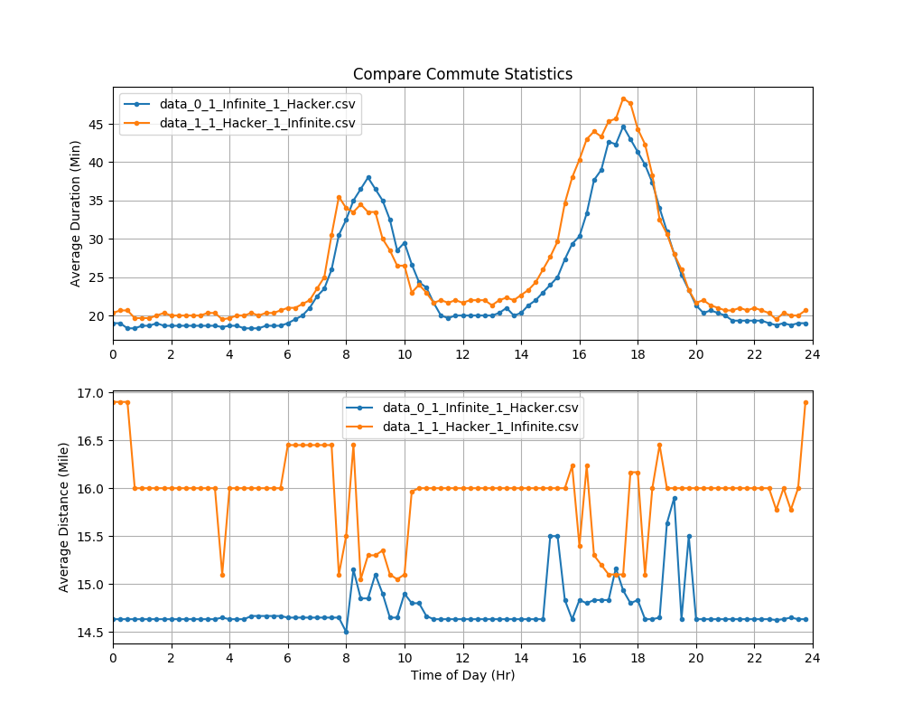

# Commute Helper
This is a simple utility written in python to help determine and optimize daily commute time.

## How it works

### Step 1
The first step is to call the *log_data.py* script. This script queries Google Maps periodically to collect real-time commute data with live traffic information and logs the data in a csv file. The code supports multiple from-to addresses and keep the data for each direction in its own csv file. For best results, the user should keep the script running for at least one week to collect enough data for better statistics.

Below is a sample of the csv log file. Each entry records the commute distance in miles and duration in minutes for a specific date and time.  The convention for weekday follows Python datetime module, Monday is 0 and Sunday is 6.

### Step 2
The second step is to call the *plot_all_data.py* script, which plots the statistics of all the commute data. These plots can help the user determine the best time to start their commute in the morning and in the afternoon and minimize the time spent in traffic.

Below is a sample plot of the commute distance and duration from Apple HQ at 1 Infinite Loop in Cupertino to Facebook HQ at 1 Hacker Way in Menlo Park.

### Other Functions
One can compare the commute data between any two csv files using the *compare_data.py* script. Below is a sample plot, comparing the commute from Apple HQ to Facebook HQ and from Facebook HQ to Apple HQ.

